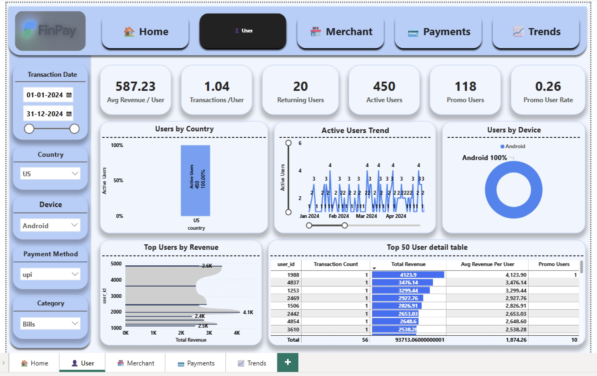
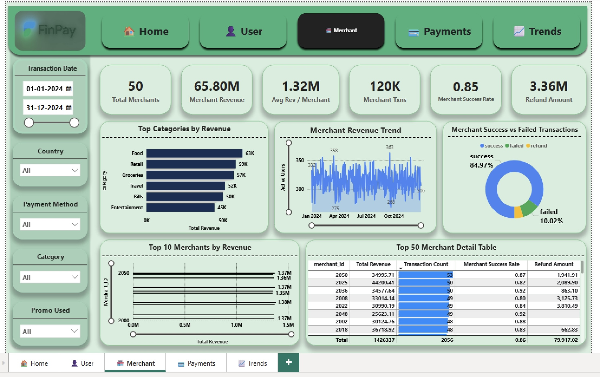

# 🎨 FinPay Analytics Dashboard  
**Google Pay–Inspired | Built in Power BI**

---

## 📌 Project Overview

**FinPay Analytics Dashboard** is an end-to-end Power BI project built using a **120K+ synthetic fintech transaction dataset**.  
The data is modeled using a **Fact–Dimension (Star Schema)** approach and visualized with a **Google Pay–inspired UI**.

This dashboard helps analyze:
- User behavior
- Merchant performance
- Payment success & failures
- Promotion effectiveness
- Time-based trends (MoM%)
- Hour & day usage patterns

---

## 🧠 Skills Demonstrated

- Data cleaning & transformation (Power Query)
- Fact & Dimension data modeling
- Advanced DAX (MoM%, Pareto, conversion rates)
- KPI design & storytelling
- Interactive dashboard UX
- FinTech analytics concepts

---

## 📂 Project Structure
```text
FinPay-Analysis/
├── data/
│   ├── raw/
│   │   └── transactions_large.csv
│   └── transformed/
│       ├── dim_user.csv
│       ├── dim_merchant.csv
│       ├── dim_date.csv
│       ├── dim_country.csv
│       ├── dim_device.csv
│       ├── dim_payment_method.csv
│       └── fact_transactions.csv
│
├── powerbi/
│   └── FinPay_Dashboard.pbix
│
├── docs/
│   ├── data_dictionary.md
│   └── screenshots/
│       ├── Overview.jpg
│       ├── Users.jpg
│       ├── Merchants.jpg
│       ├── Payments.jpg
│       ├── Trends.jpg
│       └── Banner.png
│
├── .gitignore
├── LICENSE
└── README.md
```

## 📊 Dashboard Pages

### 🔹 1. Overview Page
- Total Revenue
- Transaction Count
- Average Ticket Size
- Promo Conversion Rate
- Category-wise Revenue (Pareto)
- Revenue Trend
- Payment Method Split


---

### 🔹 2. User Insights
- Active & returning users
- Promo vs non-promo users
- Users by device & country
- Top users by revenue
- Hour vs day heatmap



---

### 🔹 3. Merchant Insights
- Top merchants by revenue
- Category performance
- Promo impact on merchants
- Merchant activity trends



---

### 🔹 4. Payment Insights
- Transaction success rate
- Failed transaction reasons
- Refund analysis
- Revenue by payment method


---

### 🔹 5. Trends Page
- Revenue MoM%
- Transaction MoM%
- Promo vs non-promo revenue
- Payment method trends
- Weekday vs hour heatmap


---

## 📘 Data Dictionary

Detailed column-level documentation:  
👉 [docs/data_dictionary.md](docs/data_dictionary.md)

---

## 🔧 How to Use This Project

### 1️⃣ Clone the repository


git clone https://github.com/yashodip05/FinPay-Analytics-Dashboard.git

2️⃣ Open Power BI file
PowerBI/FinPayDashBoard.pbix

3️⃣ Load the data
Ensure Power BI points to:
data/transformed/ → fact & dimension tables
data/raw/transactions_large.csv → original dataset

4️⃣ Explore & extend
You can:
Add new DAX measures
Modify visuals
Apply new themes
Connect real-world datasets

🏷 Repository Topics
powerbi · data-analysis · data-visualization · fintech · google-pay ·
analytics-dashboard · dax · business-intelligence · portfolio-project

## 📜 License
This project is licensed under the **MIT License**.  
 👉 [View License](./LICENSE)


```
👤 Author : Yashodip Kamble
If you found this project useful:
⭐ Star the repository
🔁 Fork it
🔗 Share on LinkedIn
